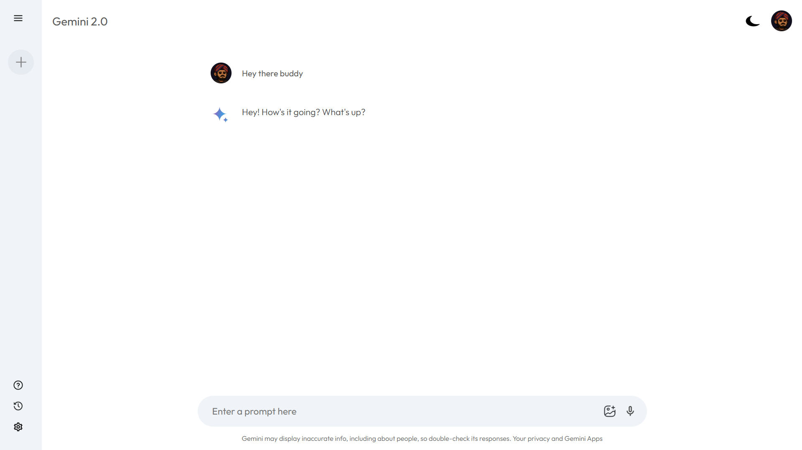

# Gemini 2.0



A modern conversational AI app built with **React** and the **Gemini API**.  
This project shows how I combine clean design, smart architecture, and real-world API use.

---

## 🔑 Key Highlights
- **Clean UI** → Dark/Light mode with CSS variables.  
- **React + Context API** → State management for chat history & loading.  
- **API Integration** → Async calls to Gemini API with smooth UX.  
- **Modular Code** → Easy to read, reuse, and scale.  
- **Responsive Design** → Works well on any screen.  

---

## 🛠️ Skills & Tools Used
- React & Front-end Development  
- API Integration & Data Handling  
- Component-based Architecture  
- Responsive & Modern UI Design  
- Clean Git Workflow  

---

##  Run It Yourself
```bash
git clone https://github.com/ArshLabs/github-2.0.git
cd github-2.0
npm install
echo VITE_GEMINI_API_KEY="YOUR_GEMINI_API_KEY" > .env
npm run dev
```
---

## 📸 Screenshots
<p align="center">
  
</p>

<p align="center">
  
</p>

---

##  Credits  

⚡ Powered by ArshLabs
